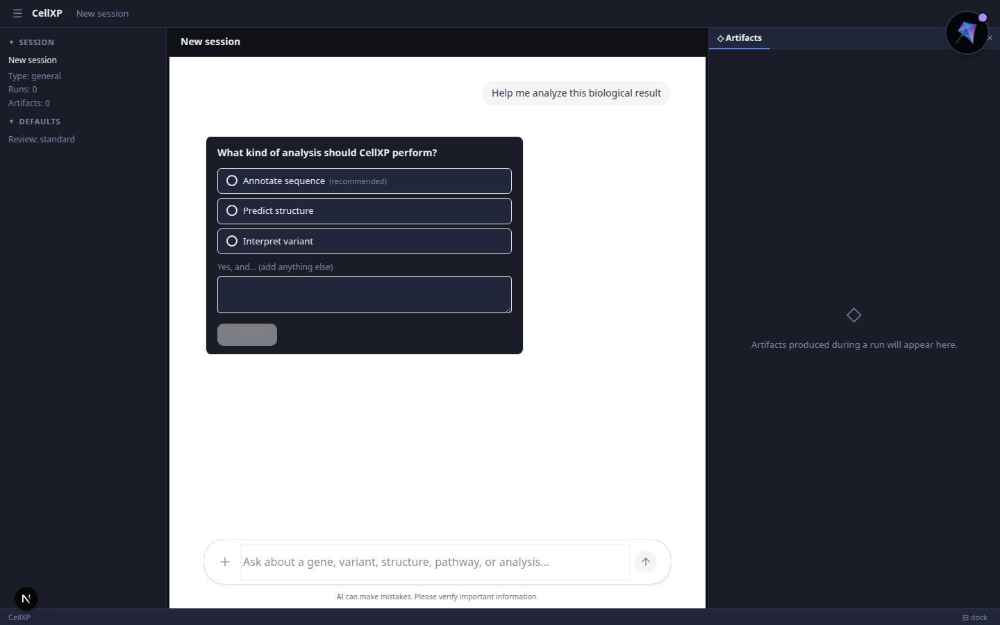
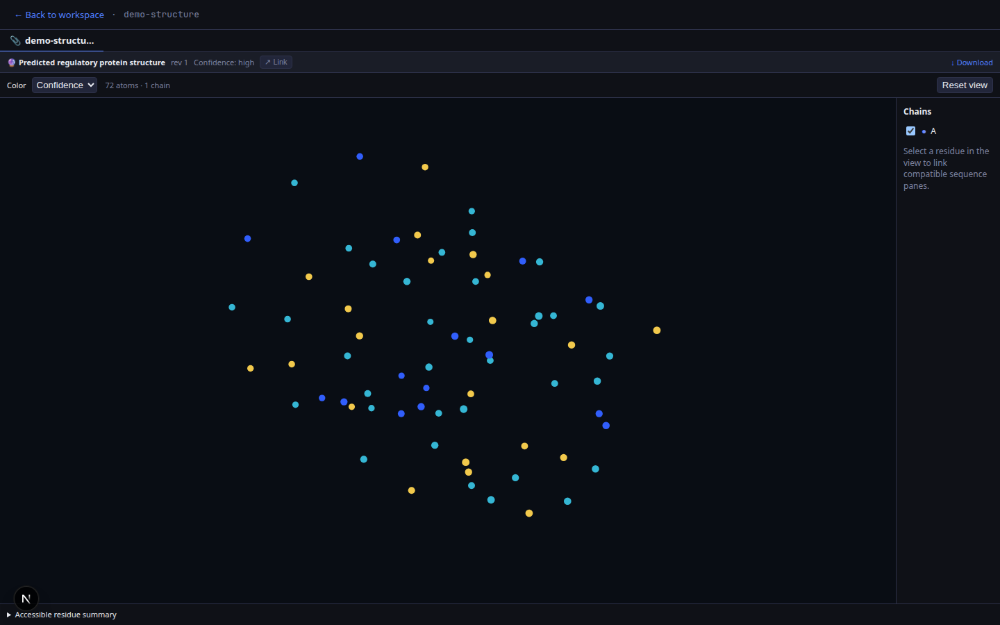

# CellXP

CellXP is an agentic workspace for genomics and molecular biology. Ask about a variant, sequence,
protein, pathway, or design goal; CellXP plans the analysis, runs typed biological capabilities, and
returns a cited answer with interactive scientific artifacts and a reproducible trace.



> **Active implementation.** CopilotKit/AG-UI chat, canonical runs, typed artifacts, durable
> clarification/review, and the harness-neutral skill-kernel foundation are implemented. Live model
> predictions still require configured workers and weights. Qwen Code and Qwen3.8-27B are selected
> targets, not silently enabled defaults. Specs and architecture docs remain the source of truth.

## Why CellXP

Biological questions rarely map to one model call. A useful answer may require reference/assembly
resolution, coordinate normalization, model selection, GPU inference, literature retrieval,
cross-model evidence integration, uncertainty reporting, visualization, and human review.

CellXP makes that workflow conversational while keeping the important parts explicit:

- **Evidence, not opaque answers** — claims link to model/database evidence and confidence.
- **Typed biological artifacts** — genome tracks, locus plots, structures, contact maps, guide
  tables, and reports render as inspectable workspace objects rather than JSON dumps.
- **Reproducible runs** — tool inputs, versions, outputs, provenance, and decisions are recorded.
- **Human review for actionable biology** — candidate edits/designs remain withheld until reviewed.
- **Organism-aware correctness** — organism, assembly, strand, and coordinate convention are
  validated; human-only model assumptions are never applied silently.
- **Local-first operation** — self-hosted reasoning and domain-model profiles are first class;
  hosted providers are explicit opt-ins.

## Product surface

The primary browser experience uses CopilotKit v2 over a CellXP-owned AG-UI adapter:

- streaming chat with visible tool activity;
- shared, bounded workspace context;
- clarification and actionable-review cards;
- named generative-UI renderers that open artifacts in the dock;
- canonical REST/SSE APIs for CLI/native clients;
- reconnectable sessions and inspectable run/evidence/artifact records.

### Scientific artifacts

Artifacts are typed, versioned, deep-linkable, and backed by accessible summaries/exports. Large
payloads stay in object storage and enter model context only through authorized handles.



The screenshots above are generated with deterministic Playwright fixtures. Regeneration
instructions live in [`documentation/assets/screenshots/README.md`](documentation/assets/screenshots/README.md).

## Capabilities

| Area | Current capability surface | Representative models/data |
|---|---|---|
| Regulatory genomics | Variant effects, sequence annotation, binding deltas | AlphaGenome, Evo 2 |
| Association evidence | GWAS/QTL lookup, fine-mapping, colocalization | GWAS Catalog, Open Targets |
| Structure and binding | Protein/NA structure, contacts, DNA shape | ESMFold, Boltz-2 |
| Genome engineering | CRISPR candidates, off-target scoring, inverse edit design | Azimuth, Cas-OFFinder, forward-model oracles |
| Systems biology | Networks, metabolism, cross-scale evidence composition | Typed service/workflow plugins |
| Literature | Citation-preserving PubMed/RAG retrieval | PubMed, local vector index |
| Visualization | Genome tracks, locus plots, structures, tables, reports | CellXP renderers |
| Nanotechnology | DNA origami routing/export workflows | oxDNA, cadnano |

Human, mouse, and bacterial references are first-class. The contracts are organism-agnostic and
include circular microbial genomes and organism-specific model applicability.

## Architecture

CellXP no longer treats a LangGraph graph as the target product harness. The stable boundary is a
typed skill/plugin runtime with a CellXP-owned policy kernel:

```text
CopilotKit chat + biological artifact workspace
                    │
          same-origin Next.js runtime
                    │ AG-UI
                    ▼
FastAPI canonical runs / events / artifacts / interrupts
                    │
       CellXP policy kernel (authoritative)
     risk · auth · coordinates · budgets · provenance · review
                    │
                    ▼
      HarnessAdapter (Qwen Code is first target)
                    │
        typed SkillPlugin registry / workflows
                    │
     services + async CPU/GPU workers + storage
```

The current LangGraph supervisor remains a **compatibility workflow** while capabilities migrate
behind bounded skills. It does not receive new harness responsibilities. Existing capability nodes
can run through `harness/langgraph_compat.py`, which constructs a minimal internal state slice; raw
`AgentState` is never a model-facing tool schema.

Qwen Code is the first mature adapter target because it already provides coding/file workflows,
skills, sub-agents, memory/compaction, MCP, lifecycle hooks, sessions, sandbox support, and
self-hosted OpenAI-compatible providers. Its hooks are useful fast feedback—not the authority for
biological safety or approval. See
[`ADR-0008`](documentation/adr/0008-harness-neutral-skill-kernel.md) and the
[`skill/plugin contract`](specs/agent/skill_plugin_contract.md).

### Model profiles

- **Current modest-hardware default:** local Ollama (`gemma4:4b`) for compatibility/development.
- **Target quality profile:** `Qwen/Qwen3.8-27B` through a pinned vLLM/SGLang
  OpenAI-compatible endpoint, gated by biology/tool/safety/latency evaluations.
- **Domain models:** isolated workers for AlphaGenome/Evo 2, ESMFold/Boltz-2, CRISPR, GWAS, and
  other capabilities; model revision and provenance are recorded per call.

No 27B download, remote provider, or private-data transfer happens silently.

## Quickstart

### Prerequisites

- Python 3.11+
- Node 22 and Corepack/pnpm 10
- Docker only for the full Postgres/Redis/Ollama stack

### Install

```bash
python3 -m venv .venv
.venv/bin/pip install -e ".[dev]"
corepack enable
pnpm --dir src/frontend install --frozen-lockfile
```

For the complete environment, infrastructure, and configured local models, use the idempotent setup
script:

```bash
./scripts/setup.sh
```

### Run the local development path

The fast local path uses SQLite and in-process execution; it does not require Postgres or Redis.

```bash
# terminal 1 — FastAPI on :8001
./scripts/dev_api.sh

# terminal 2 — Next.js/CopilotKit on :3000
./scripts/dev_frontend.sh
```

Open <http://localhost:3000/chat>. FastAPI docs are at <http://localhost:8001/docs>.

The UI and deterministic workflow are usable without model weights. A capability that needs an
unconfigured worker reports that boundary honestly instead of fabricating a prediction.

### Verify

```bash
make test PYTHON=.venv/bin/python
.venv/bin/ruff check src/backend tests evals
.venv/bin/mypy src/backend/cellxp

pnpm --dir src/frontend lint
pnpm --dir src/frontend build
pnpm --dir src/frontend test:browser
```

The default test suite excludes `live`, `gpu`, `slow`, and evaluation-marked tests. Model acceptance
is opt-in and requires the corresponding worker, weight, reference, and hardware profiles.

## Repository map

```text
src/backend/cellxp/
├── harness/       # skill contracts, registry, policy kernel, harness adapters
├── agent/         # LangGraph compatibility workflow, state, legacy nodes/subgraphs
├── api/           # FastAPI REST/SSE + AG-UI adapter
├── services/      # biological capability/model adapters
├── domain/        # canonical coordinates, evidence, artifacts, safety types
├── jobs/          # Redis/CPU/GPU job execution
└── storage/       # relational, object, cache, vector, audit/provenance

src/frontend/
├── app/           # Next.js routes and CopilotKit runtime broker
├── components/    # chat, workspace, genome, plots, structure, tables
└── lib/           # API, streaming, artifact, and shared-state contracts

specs/             # normative product/agent/biology/interface/service contracts
documentation/     # architecture explanations, ADRs, guides, and references
tests/             # unit, integration, contract, E2E, and Playwright coverage
evals/             # biological correctness, safety, and regression gates
```

New contributors should start with [`.agents/onboarding.md`](.agents/onboarding.md), then read only
the task-specific specs it points to.

## Safety and correctness invariants

These are runtime policy, not prompt suggestions:

1. Risk clearance precedes biological capability execution.
2. Actionable outputs cannot become recommendations or exports before canonical human review.
3. Organism, assembly, coordinate convention, and strand are explicit for positioned work.
4. Every substantive model/tool call records a provenance-bearing `Step`.
5. Large/private payloads are referenced, authorized, and selectively read—not pasted into context.
6. Code, shell, filesystem, network, and MCP tools run in bounded per-run sandboxes.

The detailed contracts are in
[`harness_and_context_engineering.md`](specs/agent/harness_and_context_engineering.md),
[`human_review_policy.md`](specs/agent/human_review_policy.md), and
[`safety_model.md`](documentation/explanation/safety_model.md).

## Documentation

- [Product mission](specs/product/mission.md)
- [Architecture overview](documentation/explanation/architecture_overview.md)
- [CopilotKit and harness integration plan](specs/planning/copilotkit_integration.md)
- [Artifact model](specs/interface/artifact_model.md)
- [External models and services](documentation/reference/external_models_and_services.md)
- [Roadmap](specs/planning/roadmap.md)
- [Contributing](CONTRIBUTING.md)

## Contributing

Capabilities are added as typed services + harness-neutral skills, not by editing a central agent
prompt or expanding the compatibility graph. Contributions must preserve safety, coordinates,
provenance, confidence, review, and evaluation contracts. See [`CONTRIBUTING.md`](CONTRIBUTING.md).
