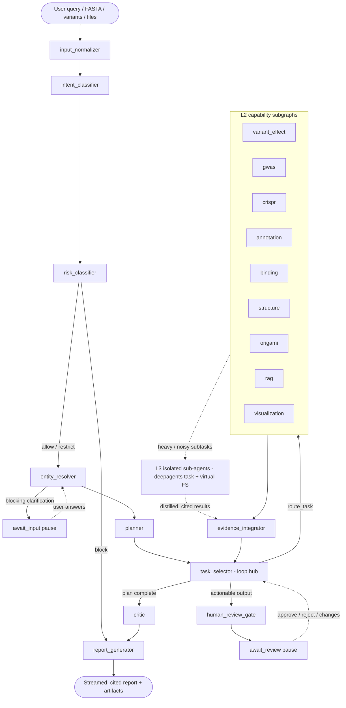

# Agent Graph Specification

> Status: Draft v0.1. Defines the LangGraph control flow: nodes, subgraphs, edges, and how a run
> advances. Consumes the state contract (`state_schema.md`) and is consumed by `routing_policy.md`
> (edge conditions), `tool_use_policy.md` (what nodes call), `human_review_policy.md` (the gate), and
> `evidence_integration.md`. Implementation: `src/backend/cellxp/agent/graph.py`,
> `agent/nodes/*`, `agent/subgraphs/*`, `agent/routing.py`.

## 1. Overview

A **supervisor with subgraphs** (ADR-0002): a top-level graph handles understanding, planning,
routing, integration, review, and reporting; domain work is delegated to capability **subgraphs**.
All nodes read/write the single `AgentState` (`state_schema.md`). The multi-agent layering (L1
supervisor / L2 capability agents / L3 isolated sub-agents) is explained in
`documentation/explanation/multi_agent_architecture.md`.

## 1.1 Architecture diagram

> Rendered from Mermaid (displays as a diagram in Cursor/GitHub and most Markdown viewers; export to
> PNG/SVG via any Mermaid renderer if a raster is needed). Kept as text so it stays in sync with the
> spec. Nodes marked actionable (`crispr`, `origami`, design) route through the review gate.



Legend: solid arrows = control flow; dotted arrows = pause/resume or delegation. `risk_classifier`
runs **before** any capability (safety first); `task_selector` is re-entered after each subgraph
until the plan completes, fails, or hits budget; there are two durable pauses (`await_input`,
`await_review`). See `documentation/explanation/multi_agent_architecture.md` for the agent layers and
`specs/agent/control-flow/*` for the dynamics.

## 2. Top-level graph (current implementation)

The N3 graph (`graph.py`) implements the safety-first preamble, blocking clarification pause, typed
planning, dependency-aware task loop, graceful capability failure, and terminal report synthesis:

```
START
  → input_normalizer
  → intent_classifier
  → risk_classifier
      └──(block)─────────────────────────────────────────▶ report_generator → END
  → entity_resolver
      └──(blocking clarification)──▶ await_input ─────────┐
                                                          ▼
  → planner
  → task_selector ──(route_task)──▶ {variant_effect | gwas | crispr | annotation | binding |
  │                                   structure | origami | rag | visualization}_subgraph
  │                                        │
  │                                        ▼
  │                                 evidence_integrator ─┘
  └──(no ready work / budget exhausted)──▶ critic → report_generator → END
```

Capability nodes are injectable. Until their roadmap slices land, the defaults fail honestly with a
typed recoverable error, allowing the full control loop and partial-result report path to execute
without claiming model results. Intent/entity/planning nodes currently provide deterministic
bootstrap behavior behind their stable state contracts; provider-backed reasoning can be added
without changing graph topology.

The remaining additive topology change is the `human_review_gate`/`await_review` branch tracked by
X6. Macro registration, concurrent dispatch, and evidence-driven replanning remain later extensions.

## 3. Target top-level graph

```
START
  → input_normalizer        (raw_inputs → normalized_inputs; alphabet/file parsing)
  → intent_classifier       (sets intent; routing_policy §intent)
  → risk_classifier         (sets risk EARLY, before any capability; safety_model)
  → entity_resolver         (resolves entities; may emit blocking Clarification)
  → [gate: needs_input?] ──yes──▶ await_input ▶ (resume) ─┐
  │                                                        │
  → planner                 (builds Plan: atomic | macro | composed; task taxonomy)
  → task_selector           (selects next ready Subtask; route_task)
        │
        ├──(capability)──▶ <capability>_subgraph ─▶ evidence_integrator
        │                                                  │
        │           ┌──────────────(more ready subtasks)───┘
        │           ▼
        │     task_selector            (loop until plan complete / budget hit)
        │
        ├──(actionable produced)──▶ human_review_gate
        │                               │
        │                   [await_review] ─approved▶ continue / ─rejected▶ revise|stop
        │
        └──(plan complete)──▶ critic ─▶ report_generator ─▶ END
```

Key differences from the scaffold:
- **`risk_classifier` moves before `entity_resolver`/capabilities** (safety first, `FR-34`).
- **`task_selector` is a loop hub**, not a one-shot switch — it re-enters after each subtask so
  composed/macro plans with multiple/dependent subtasks (and inverse-design loops) run to completion.
- **Two pause points**: `await_input` (blocking clarification) and `await_review` (human gate).

## 4. Node catalog (top-level)

| Node | File | Reads | Writes | Purpose |
|---|---|---|---|---|
| `input_normalizer` | `nodes/input_normalizer.py` | `raw_inputs` | `normalized_inputs` | parse/validate text, files, sequences; set alphabet |
| `intent_classifier` | `nodes/intent_classifier.py` | `user_query`, inputs | `intent` | classify intent (`routing_policy.md`) |
| `risk_classifier` | `nodes/risk_classifier.py` | query, intent, inputs | `risk` | early safety classification (`safety_model.md`) |
| `entity_resolver` | `nodes/entity_resolver.py` | inputs, query | `entities`, `clarifications` | resolve genes/variants/intervals/organism/assembly |
| `planner` | `nodes/planner.py` | intent, entities, risk | `plan`, `subtasks` | choose macro or build atomic/composed plan |
| `task_selector` | `nodes/task_selector.py` | `subtasks`, `cursor` | `cursor` (+ route) | pick next ready subtask; route to subgraph |
| `evidence_integrator` | `nodes/evidence_integrator.py` | `evidence`, `artifacts` | `evidence` (merged) | normalize/merge evidence (`evidence_integration.md`) |
| `human_review_gate` | `nodes/human_review_gate.py` | `subtasks`, `artifacts` | `review` | enforce actionable-biology gate (`human_review_policy.md`) |
| `critic` | `nodes/critic.py` | evidence, report draft | `evidence`/flags | self-check quality/consistency before report |
| `report_generator` | `nodes/report_generator.py` | all | `final_report` | synthesize cited answer + followups |

Prompts for LLM-backed nodes: `agent/prompts/*` (`supervisor.md`, `planner.md`, `entity_resolver.md`,
`critic.md`, `report_writer.md`).

## 5. Capability subgraphs

Each capability is a subgraph under `agent/subgraphs/` with a uniform contract:

- **Input:** the selected `Subtask` (+ relevant `normalized_inputs`/`entities`).
- **Behavior:** runs its internal **steps** (light prep + heavy core; recorded per `state_schema.md`
  §8), calling services via the registry (`tool_use_policy.md`).
- **Output:** appends `evidence` + `artifacts`, sets `Subtask.status` and `result_ref`.

| Subgraph | File | Primary services / models |
|---|---|---|
| `variant_effect` | `subgraphs/variant_effect.py` | AlphaGenome / Evo 2 (catalog §1) |
| `gwas` | `subgraphs/gwas.py` | GWAS Catalog, Open Targets, SuSiE (§9) |
| `crispr` | `subgraphs/crispr.py` | guide design + off-target (§10) — **actionable** |
| `annotation` | `subgraphs/annotation.py` | Bakta/Pyrodigal, AlphaGenome (§7) |
| `binding` | `subgraphs/binding.py` | AlphaGenome heads, ChromBPNet, FIMO (§6) |
| `structure` | `subgraphs/structure.py` | ESMFold, Boltz-2 (§3/§4/§5) |
| `origami` | `subgraphs/origami.py` | cadnano/scadnano (§16) — **actionable** |
| `rag` | `subgraphs/rag.py` | PubMed, retriever (§17) |
| `visualization` | `subgraphs/visualization.py` | visualization service |

Composed/systems-level patterns (`task_patterns.md` §2–§6) are realized as **multi-subtask plans**
that traverse several of these subgraphs (and may add subtasks across planner revisions for loops);
no new top-level node is needed.

## 6. Control flow rules

1. **Safety precedes capabilities.** No capability subgraph runs before `risk_classifier` sets
   `risk`; a blocking risk routes to refusal/escalation (`safety_model.md`), skipping to
   `report_generator`.
2. **Resolve-or-ask.** If `entity_resolver` emits a blocking `Clarification`, the run enters
   `await_input` and pauses; it resumes when the user answers (`FR-7`).
3. **Plan, then loop.** `planner` sets `plan.kind`; `task_selector` dispatches ready subtasks
   (respecting `depends_on`) and re-enters until the plan completes, fails, or hits `budget`.
4. **Gate actionable output.** When a subtask marked `is_actionable` produces an artifact,
   `human_review_gate` sets `review.required`; the run enters `await_review` and cannot present a
   recommendation until approved (`FR-25/26`, ADR-0005).
5. **Degrade gracefully.** A recoverable subtask error appends to `errors`, marks the subtask
   `failed`, and continues with partial results (`NFR-6`); a fatal error sets `status=failed`.
6. **Always synthesize.** Every terminating path ends at `report_generator`, which reports whatever
   evidence exists (including "insufficient evidence").

## 7. Routing functions

`task_selector` uses `route_task` (`agent/routing.py`) to map the active subtask's `type` to a
subgraph. The current implementation routes on `subtasks[0].type`; the target reads
`cursor.active_subtask_id` and returns the next destination (subgraph, `human_review_gate`, or
`report_generator`). Routing policy (intent→plan, macro-match, fan-out) is specified in
`routing_policy.md`.

## 8. Pause / resume (human-in-the-loop)

Pauses use LangGraph interrupts + state checkpointing:
- `await_input` — open blocking `Clarification`; `status=awaiting_input`.
- `await_review` — pending `ReviewState`; `status=awaiting_review`.
The API exposes resume endpoints (answer clarification, submit review decision) that re-enter the
graph at the paused node (`api_contracts.md`). State is durable across the pause (`specs/data/*`).

## 9. Concurrency

Independent ready subtasks MAY execute concurrently (e.g. variant_effect + gwas for the same locus).
Concurrent nodes MUST only write append/merge-by-id state fields (`state_schema.md` §16). Heavy steps
dispatch to job workers and the subgraph awaits results without blocking the top-level loop.

## 10. Adding a node / subgraph

See `documentation/guides/adding_a_langgraph_node.md`. Contract: a new capability adds a subgraph
under `agent/subgraphs/`, registers its service(s), declares selection metadata
(`tool_use_policy.md`), and is reachable from `task_selector` via `route_task` — without changing the
top-level spine (`NFR-11`, ADR-0003).

## 11. Open questions

- Does `critic` run once pre-report or per-subtask? (currently once, pre-report.)
- Should the review gate be a single node or per-actionable-subtask interrupts? (currently one node
  aggregating `ReviewItem`s.)
- Replanning trigger: who decides a composed plan needs another subtask — `critic` or `planner`
  on re-entry?

## 12. Related specs

`state_schema.md` · `routing_policy.md` · `tool_use_policy.md` · `evidence_integration.md` ·
`human_review_policy.md` · `safety_model.md` · `task_patterns.md` · `session_types.md` ·
`control-flow/*` · `documentation/explanation/architecture_overview.md` §5 ·
`documentation/explanation/multi_agent_architecture.md` ·
`documentation/explanation/harness_and_context_engineering.md`.
